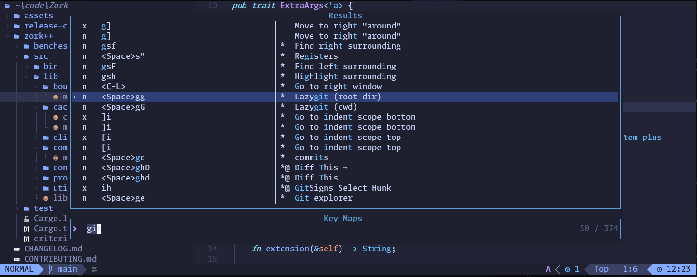

# My personal `Neovim` configuration and set up

Hello everyone!

This repo is made just to track the progress of the **from O to IDE** creating and configuring from scratch
my own `neovim` set up.

This allows me to keep tracked the changes I introduce over the time, see how my personal configuration evolves over the time and share it with anyone instead while I am able to make some sort of tutorial while I am writing it.

Also, this allows me to have a reference point whenever I got into a new computer or set up, so I can quickly just `git clone` this repository and start to work immediately.

## Config and Set Up across different OS

I mostly do my coding personal job on `Linux` and `Windows` (like 70% - 30%) and my professional paid job the other way around, `Windows` and `Linux` (like 85% - 15%), and I use `Linux` mostly though `WSL`.

So you won't find any interesting here about `Mac`

For `Unix` users, vim already comes by default on most of the modern distros. And `nvim` is an easy to get one.
But `Windows` is a different kind of thing. You'll need to do some job to get your `nvim` working fine or it, so I'll let you [here](https://medium.com/nerd-for-tech/neovim-but-its-in-windows-f39f181afaf9) a nice guide of how to get and install it on `Windows`.

## Package manager

When I first started with `Neovim`, I liked to use `packer` as my package manage. But it went unmaintained, and several candidates raised up as alternatives.

Finally, I decided to go with [lazy.vim](https://github.com/folke/lazy.nvim), since the set of features brings a lot of power to my daily development workflow and also comes
with a lot of predefined niceties that makes it wonderful.

## The **<leader>** key and custom Remaps

I like to have the `<leader>` key mapped to the `spacebar` key.
The space bar is extremely fast and comfortable, since I am able to reach it with both hands quickly and without having to make any estrange movements with any of my fingers.

My `<localleader>` is the `\` key.

All the keymaps and custom remaps configured for this setup are in the [keymaps file](./lua/config/keymaps.lua)
or directly set up in the configuration files or each individual plugin whenever it makes sense.

## Plugins

### [which-key](https://github.com/folke/which-key.nvim)

`which-key` is a **Neovim** plugin that displays a popup with possible key bindings for the command that you have started typing.

So if you aren’t quite sure about a given mapping, you can start by typing the `<leader>` key and then see the popup with suggestions for new keys you can type.

## Telescope keymaps picker

For a more detailed view of the available keymaps and remaps, you can use the `:Telescope keymaps` picker, also available through `<leader>sk` for “Search Keys”

## [Neo-tree](https://github.com/nvim-neo-tree/neo-tree.nvim)

**Neo-tree** is a Neovim plugin to browse the file system and other tree like structures in whatever style suits you, including sidebars, floating windows, `netrw` split style, or all of them at once!

### Best **Neo-tree** keymaps and/or actions

- Create a *new file* or *directory* just by typing the key `a` when `Neo-tree` is active

## [Mini Animate](https://github.com/echasnovski/mini.animate)

Plugin for animate common `Neovim` actions

## Skipping disturbing notification
s

**LazyVim** notifications can be a bit annoying at times, specially when they hide source code. You can type `<leader>un` to delete all notifications
